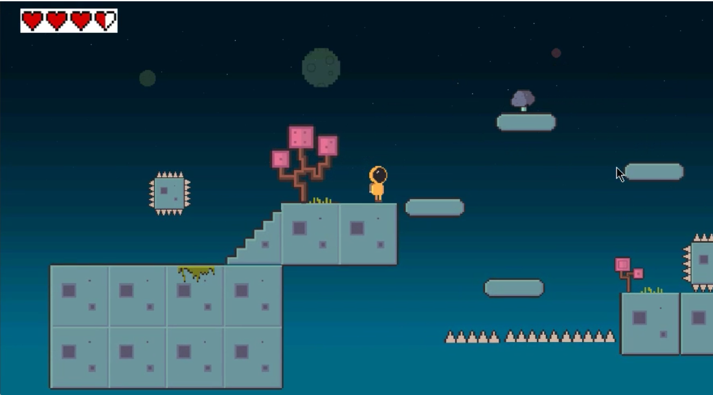
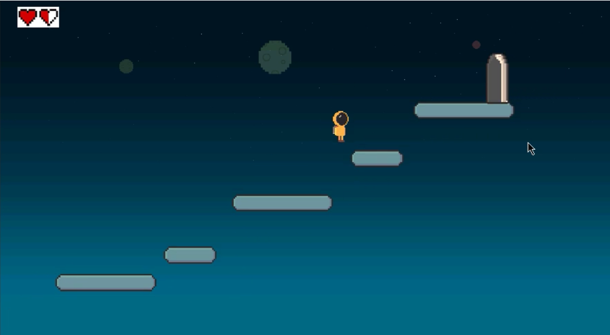
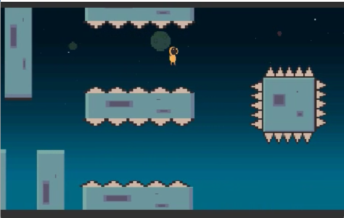
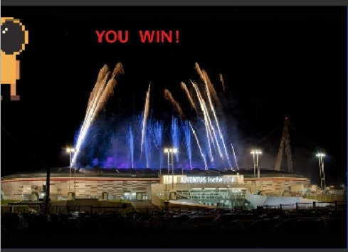

# 简介
- 这是两人合作完成的作业，感谢：https://github.com/shijiyuanaa

- 这个游戏的名字叫Astronaut Adventure，背景是一个宇航员正在宇宙中漫游，他需要找到返回航天器的入口。在第一关，宇航员在通往入口的路上有许多障碍物，在第二关，宇航员必须避开大石头和尖刺。
第一个关卡类似于Super Mario Bros，第二个关卡类似于Flappy Bird，具体细节见report.pdf.

# 游戏界面
- 第一关：

- 第二关：

